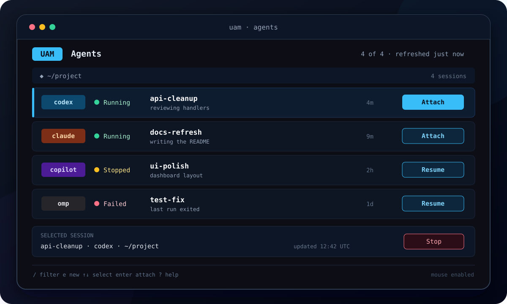

<div align="center">

# Unified Agent Manager

**One terminal dashboard for every coding-agent session.**

Start agents, leave them running, and reconnect when you are ready. No tmux required.

<p>
  <a href="https://github.com/RandomCodeSpace/unified-agent-manager/actions/workflows/ci.yml"></a>
  <a href="https://github.com/RandomCodeSpace/unified-agent-manager/actions/workflows/security.yml"></a>
  <a href="https://github.com/RandomCodeSpace/unified-agent-manager/releases"></a>
  <a href="https://github.com/RandomCodeSpace/unified-agent-manager/releases"></a>
  <a href="https://go.dev/"></a>
  
</p>

</div>

<p align="center">
  
</p>

<p align="center"><em>Dashboard preview</em></p>

UAM gives Claude Code, Codex, Copilot, Hermes, Oh My Pi, and OpenCode one
session list. Close the dashboard or lose an SSH connection and your agents
keep running. Open UAM later to attach, resume, stop, or remove them.

## Why use UAM

- **Keep agents running.** Closing your terminal does not end their work.
- **See everything together.** Running, stopped, and failed sessions share one clear roster.
- **Return without guesswork.** Reconnect to a live session or resume a stopped one.
- **Use the terminal you already have.** Mouse and keyboard controls work locally and over SSH.
- **Skip tmux setup.** UAM owns the detached session for you.

UAM manages agent processes and terminal connections. It does not create Git
branches, worktrees, commits, or filesystem isolation.

## Install

UAM runs on Linux and macOS. Download a ready-to-run archive from
[GitHub Releases](https://github.com/RandomCodeSpace/unified-agent-manager/releases),
or install it with Go:

```sh
go install github.com/RandomCodeSpace/unified-agent-manager/cmd/uam@latest
uam version
```

Native Windows is not supported. A Windows terminal can still use UAM by
connecting to a Linux or macOS host over SSH.

## Start your first agent

1. Install and sign in to at least one [supported agent](#supported-agents).
2. Check your setup, then open the guided session creator:

   ```sh
   uam doctor
   uam new
   ```

3. When you want to leave, press `Ctrl+B`, then `d`. Your agent stays running.
   Run `uam` whenever you want to return.

`uam new` asks which agent to use, where it should work, what to call the
session, and what task to start. It then connects you to the new session.

Prefer one command? Flags go before the provider name:

```sh
uam dispatch --cwd /path/to/project codex "review this package"
```

## Supported agents

UAM detects installed agent CLIs automatically. Missing agents stay out of the
dashboard instead of causing an error.

| Agent | Command |
|---|---|
| Claude Code | `claude` |
| OpenAI Codex | `codex` |
| GitHub Copilot CLI | `copilot` |
| Hermes Agent | `hermes` |
| Oh My Pi | `omp` |
| OpenCode | `opencode` |

OpenCode 1.18.1 or newer is required.

Continuing a stopped session varies by agent. Some return to an exact
conversation, while others may ask before continuing the latest one. Hermes
requires a new Managed Session. See the
[provider resume table](docs/responsive-tui.md#provider-resume-and-terminal-policy)
for the exact behavior.

## Everyday commands

| Command | What it does |
|---|---|
| `uam` | Open the dashboard |
| `uam new` | Create a session with a guided form |
| `uam dispatch <agent> "<task>"` | Start a session directly |
| `uam ls` | List every saved session |
| `uam last` | Attach to the most recent session |
| `uam doctor` | Check providers, sessions, and configuration |
| `uam --help` | Show the full command reference |

## Essential controls

In the dashboard:

| Input | Action |
|---|---|
| Click a row or press `Up` / `Down` | Select a session |
| Click `Attach` / `Resume` or press `Enter` | Open the selected session |
| `/` | Filter sessions |
| `e` | Create a session |
| `Ctrl+X` | Stop or remove the selected session after confirmation |
| `?` | Show more shortcuts |
| `Esc` | Close the current view or leave the dashboard |

While attached, the default prefix is `Ctrl+B`:

| Input | Action |
|---|---|
| `Ctrl+B`, then `d` | Detach and leave the agent running |
| `Ctrl+B`, then `c` | Send `Ctrl+C` to the agent |
| `Ctrl+B`, then `i` | Show connection and profile details |

Plain `Ctrl+C` and `Ctrl+Z` are held back while attached so they do not
accidentally terminate or suspend the detached agent.

## Safety

By default, UAM uses an agent's broad-access or auto-approve option when one is
available. Use `--safe` to keep the agent's normal approval prompts:

```sh
uam dispatch --safe codex "review this repository"
```

`--safe` changes the agent's launch options. It is not an operating-system
sandbox. Multiple sessions can also edit the same directory at once, so use
separate Git worktrees or checkouts when tasks need isolation.

## Need help?

- Run `uam doctor` for a quick local diagnosis.
- Read the [dashboard and remote-use guide](docs/responsive-tui.md) for small terminals, mouse behavior, filtering, and SSH use.
- Read [terminal and OS support](docs/terminals.md) for compatibility and troubleshooting.
- Open a [bug report or feature request](https://github.com/RandomCodeSpace/unified-agent-manager/issues).

## Build and contribute

```sh
make build
make test
make test-e2e
```

Source builds require Go 1.25.8 or newer. Read [Testing UAM](docs/testing.md)
before changing terminal, attach, or session-host behavior.

Prebuilt binaries, checksums, SBOMs, and signing material are available on the
[releases page](https://github.com/RandomCodeSpace/unified-agent-manager/releases).
